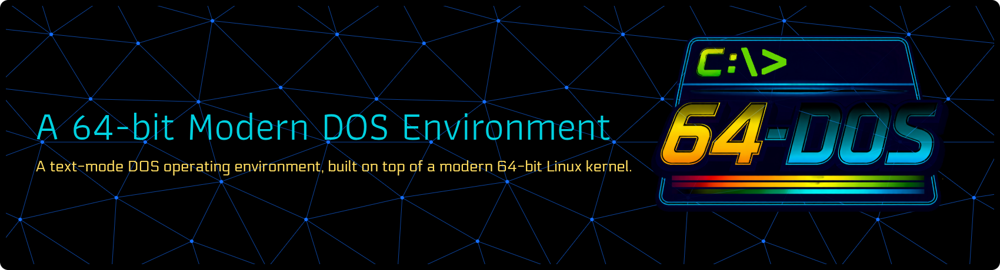
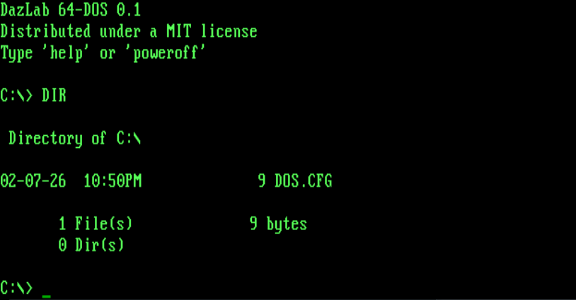

**64-DOS** is a *text-mode operating environment* inspired by MS-DOS, built on top of a modern 64-bit Linux kernel.

It boots directly into a custom C `/init` shell (no systemd, no Bash),
providing a DOS-like user experience while retaining full modern
hardware support via the Linux kernel.

This project intentionally treats Linux as a **hardware abstraction layer**,
not a user experience.

---

## What this is

- 64-bit Linux kernel
- Custom C `/init` running as PID 1
- Text-only interface
- No GNU userland
- No systemd
- No login manager
- No desktop

## What this is NOT

- Not a Linux distribution
- Not binary-compatible with real DOS (yet)
- Not a shell theme or BusyBox wrapper

---

## The Goal of the Project
I wondered what it would be like if DOS had continued to be developed, evolving with changing hardware whilst retaining
it's infamous CLI aesthetics, offering a modern alternative to the GUI paradigm. FreeDOS tries to do this, at least
to some small extent, but it's hardware support can be sketchy, and it isn't 64-bit. It's mainly concerned with providing
en environment in which to run DOS programs.

Given the inherent incompatibilities in implementing a true Real-Mode DOS on modern CPUs, and wanting to avoid the huge effort
in building a modern DOS from the ground up (as much as I would love such a project to exist), the simplest solution I could think 
of was to utilise the Linux kernel and build on top of it a custom DOS-like command shell.

### Current Features
The system currently boots into the command shell and provides a suite of DOS builtins, written in C:
- DIR
- CLS
- REN
- TYPE
- COPY
- MD/RD
- DEL

ALl currently-implemented commands support the `/?` help switch, as well as wildcards.

### Planned Upgrades
I plan to complete all builtin DOS commands and then begin working on the external ones, such as `FDISK`, `FORMAT`, `EDIT` etc.

## Requirements (host)

- Linux host (tested on Ubuntu)
- VirtualBox
- VT-x / AMD-V enabled in BIOS
- Buildroot
- gcc

---

## Build and Run (Ubuntu + VirtualBox)

This project builds a minimal Linux system (via Buildroot) that boots directly into a custom C `/init` shell (PID 1).
The workflow is: build on the host → run in VirtualBox.

### Host requirements

Hardware/firmware:
- A 64-bit CPU
- BIOS/UEFI virtualization enabled (Intel VT-x or AMD-V)

Host software (Ubuntu):
- gcc toolchain
- Buildroot build dependencies
- VirtualBox + VBoxManage
- Syslinux + FAT tools (for the BIOS boot disk)
- mtools (used in some image workflows)

## Required packages (IMPORTANT)

Install **all** of the following:

    sudo apt update
    sudo apt install -y \
      git make gcc g++ bc bison flex libncurses-dev \
      libelf-dev \
      syslinux dosfstools \
      xorriso mtools \
      fdisk \
      virtualbox

### Notes

- `libelf-dev` is required to build the kernel (`gelf.h` errors otherwise)
- Syslinux is used because VirtualBox EFI is unreliable
- VirtualBox is required for the VM workflow

---

## VirtualBox 64-bit guests (CRITICAL)

On Linux hosts, **KVM often steals VT-x / AMD-V**, preventing VirtualBox from running 64-bit guests.

Typical error:

> this kernel requires an x86_64 CPU, but only detected an i686 CPU

### Fix (must be done every boot)

    lsmod | grep -E 'kvm|vbox'
    sudo modprobe -r kvm_intel kvm    # Intel
    sudo modprobe -r kvm_amd kvm      # AMD

Verify:

    lsmod | grep kvm

If KVM is loaded, **64-bit guests will not work**.

---

## Get Buildroot

Buildroot is not installed via apt.

    cd ~
    git clone https://github.com/buildroot/buildroot.git
    cd buildroot

---

## Configure Buildroot (x86_64)

    cd ~/buildroot
    make menuconfig

Set:

- Target Architecture → x86_64  
- Init system → none  
- Linux Kernel → enabled  
- Kernel config → Default  
- Filesystem images → ext2/3/4 (use ext2)

---

## Root filesystem overlay

Create overlay directory:

    mkdir -p ~/buildroot/overlay

Re-enter menuconfig and set:

- Root filesystem overlay directories:

      /home/$USER/buildroot/overlay

Your compiled init binary **must exist at**:

    ~/buildroot/overlay/init

---

## Build

    cd ~/buildroot
    make -j$(nproc)

Artifacts appear in:

    ~/buildroot/output/images/

You should see:

- bzImage  
- rootfs.ext2  

---

## Boot method (BIOS + Syslinux)

VirtualBox EFI is unreliable.  
This project intentionally uses **BIOS + Syslinux**.

### Create BIOS boot disk (one-time)

    dd if=/dev/zero of=~/bios.img bs=1M count=64
    mkfs.vfat ~/bios.img
    syslinux --install ~/bios.img

    mkdir -p ~/bios_mount
    sudo mount ~/bios.img ~/bios_mount
    sudo cp ~/buildroot/output/images/bzImage ~/bios_mount/

Create `syslinux.cfg` with these contents:

    DEFAULT dosmodern
    LABEL dosmodern
        LINUX bzImage
        APPEND root=/dev/sdb rw init=/init console=tty0 loglevel=7

Then:

    sync
    sudo umount ~/bios_mount
    VBoxManage convertfromraw ~/bios.img ~/bios.vdi --format VDI

---

## Convert root filesystem to VDI

    cd ~/buildroot/output/images
    VBoxManage convertfromraw rootfs.ext2 dosmodern.vdi --format VDI

---

## Create the VM (one-time)

System:
- Disable EFI
- Boot order: Hard Disk first

Storage (SATA / AHCI):
- Port 0 → bios.vdi  
- Port 1 → dosmodern.vdi  

Display:
- VBoxVGA

Boot the VM. You should see:

    DazLab 64-DOS 0.1
    Distributed under a MIT License
    Type `help` or `exit`
    C:\>

---

## Development workflow

Edit → rebuild → boot.

Create a local config (not committed):

    init/local.env

Example:

    BR_DIR="$HOME/buildroot"
    VM_NAME="64-DOS"
    STORAGE_CTL="AHCI"
    ROOTFS_PORT="1"

Rebuild:

    cd init
    ./build.sh

---

## Known issues

- libelf-dev is required  
- KVM must be unloaded  
- VirtualBox EFI is avoided intentionally  
- VDI UUID collisions are handled by the build script  

---

## Contributing

This project values:

- explicit control  
- minimalism  
- text-first design  
- no hidden services  

Pull requests should preserve these principles.

---

## Architecture

See [docs/architecture.md](docs/architecture.md) for design goals, boot flow
and rationale.
