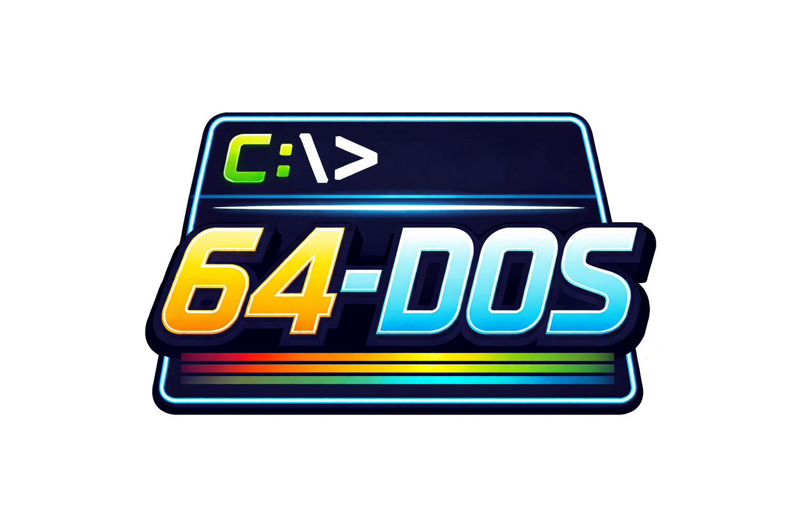

# 64-DOS

64-DOS is a **text-mode operating environment** inspired by MS-DOS,
built on top of a modern 64-bit Linux kernel.

It boots directly into a custom C `/init` shell (no systemd, no Bash),
providing a DOS-like user experience while retaining full modern
hardware support via the Linux kernel.

This project intentionally treats Linux as a **hardware abstraction layer**,
not a user experience.

---

## What this is

- 64-bit Linux kernel
- Custom C `/init` running as PID 1
- Text-only interface
- No GNU userland
- No systemd
- No login manager
- No desktop

## What this is NOT

- Not a Linux distribution
- Not binary-compatible with real DOS (yet)
- Not a shell theme or BusyBox wrapper

---

## Requirements (host)

- Linux host (tested on Ubuntu)
- VirtualBox
- VT-x / AMD-V enabled in BIOS
- Buildroot
- gcc

---

## Quick start (development)

This project assumes you already have:
- a Buildroot environment
- a VirtualBox VM wired to boot a rootfs image

### 1. Edit the init shell

```bash
cd init
nano init_shell.c
```

### 2. Rebuild and Inject `/init`

```
./build-init.sh
```

This will:
- compile `/init`
- inject it into the root filesystem image
- regenerate the VirtualBox disk
- upgrade the VM

### 3. Boot the VM

You should land directly in:

```
64-DOS init shell
C:\>
```

## Architecture

See [docs/architecture.md](docs/architecture.md) for design goals, boot flow
and rationale.
